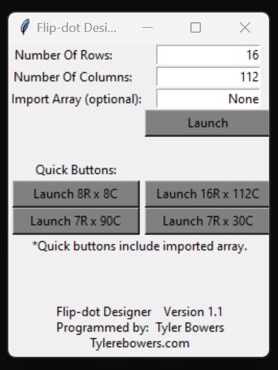

# FlipDot-Designer
This program allows you to edit and create arrays for flip dot boards of any size.

Virus total and other scanners will false flag it due to being compiled with pyinstaller.

### Examples of Program:

##### Menu

