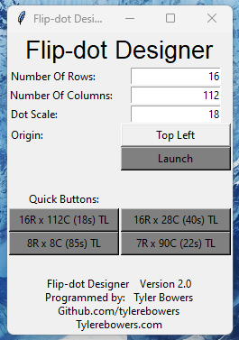
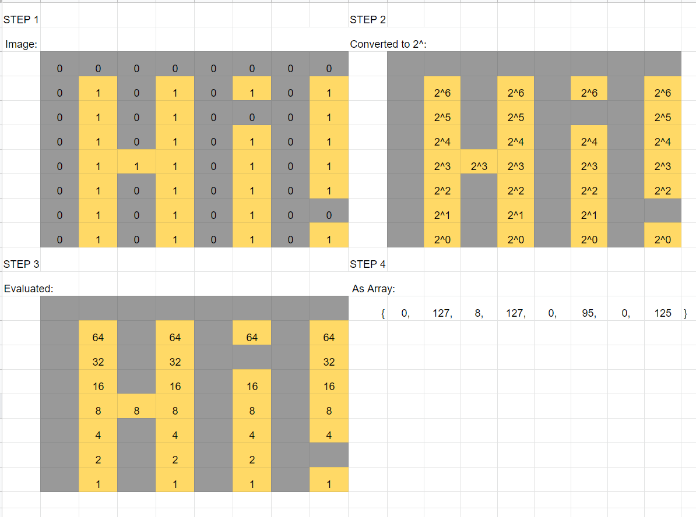
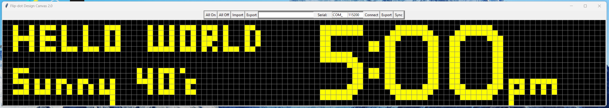
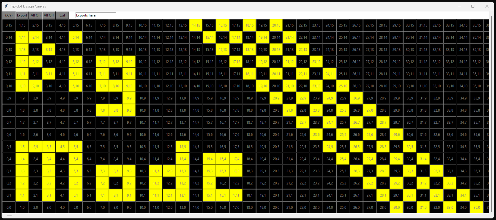
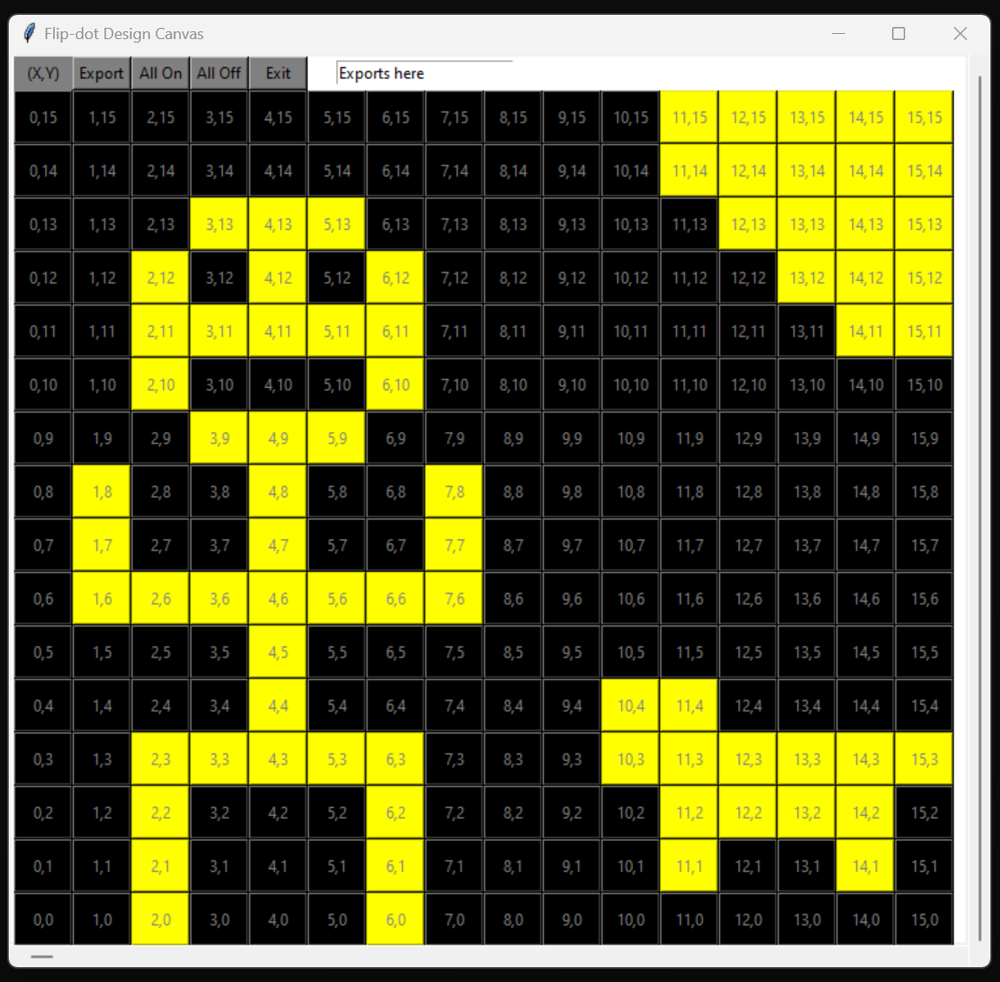
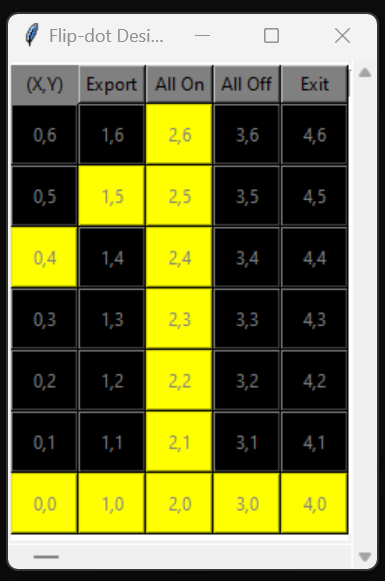

# FlipDot-Designer
This program allows you to edit and create arrays for flip dot boards of any size.

Virus total and other scanners will false flag it due to being compiled with pyinstaller. You can also just run it from the .py file if you feel unsafe :).

The program assumes that the (0,0) location stats at the bottom left side of the display and that the value of the bit increases as the y value increases. The exported array is in the format {col1, col2 col3, ...., coln}; each colx is a byte representation of the column. Exports can also be found in the terminal.

### Examples of Program:

##### Menu

##### Exporting to Array

##### How does the program work?

##### Example 1

##### Example 2

##### Example 3

##### Example 4

