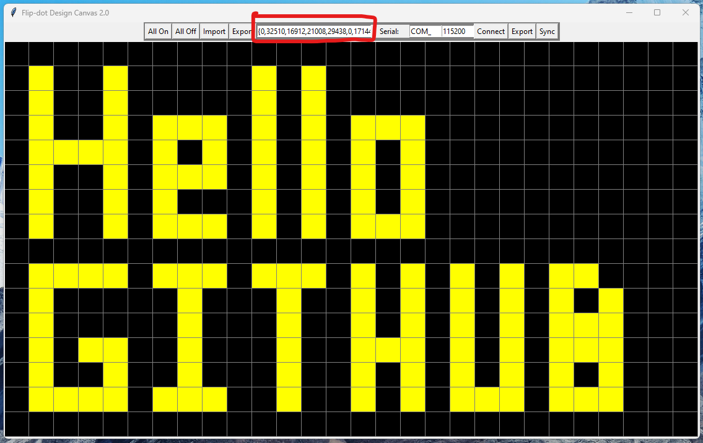
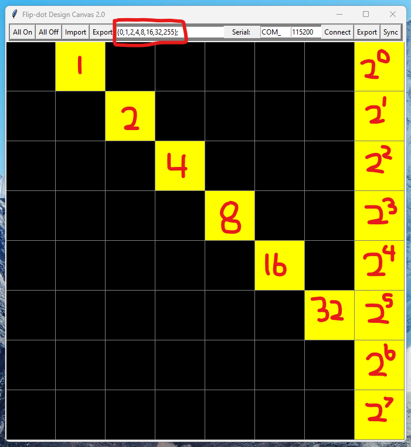

# FlipDot-Designer
With this program you can:
* Create displays and export as arrays:
  * Format {col1, col2, ... , coln} (each colx is a bitwize representation of the column)
  * Pick where you want your origin (top-left, bottom-left)
* Create display libraries such as numbers, alphabet, fonts, etc...
* Works similar to MS Paint
  * Left click or drag to turn dots on
  * Right click or drag to turn dots off
* Stream data and Export Displays over serial.
* Works with flip dot boards of any size.

Virus total and other scanners will may give a false flag it due to being compiled with pyinstaller.    
You can also just run it from the .py file if you feel unsafe :).

## Examples of Program:

### Menu

### Exporting to Array

### How does the program work?

### Example

* {0,0,11838,10760,14856,62,14336,8254,14378,42,14336,2110,12320,32,14336,2110,12320,32,14336,8254,63522,62,0,0,0,3584,2048,15934,32,15934,8736,15934,0,574,14370,10302,0,62,26,46,0,62,32,32,0,62,34,28,0,0,0,0,0,0,0,0,0,0,0,24830,24830,24774,24774,24774,29126,16262,7942,0,1584,1584,0,8184,16380,28686,24582,24582,24582,24582,28686,16380,8184,0,0,8184,16380,28686,24582,24582,24582,24582,28686,16380,8184,0,63488,10240,14336,0,14336,2048,14336,2048,14336,0,0,0,0,0,0,0,0,0};

