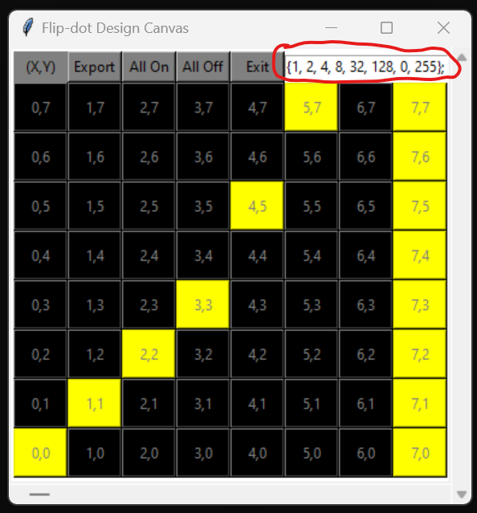
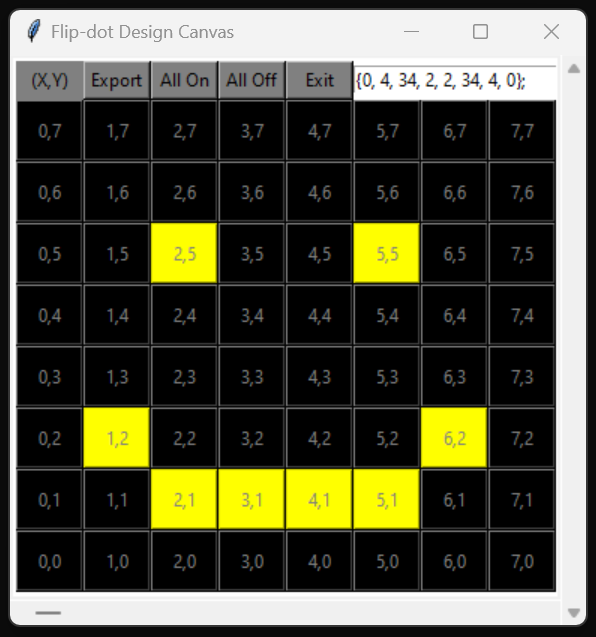

# FlipDot-Designer
This program allows you to edit and create arrays for flip dot boards of any size.

Virus total and other scanners will false flag it due to being compiled with pyinstaller. (you can also just run it for the .py file if you feel unsafe :) )

The program assumes that the (0,0) location stats at the bottom left side of the display 

### Examples of Program:

##### Menu

##### Exporting to Array

##### How does the program work?

##### Example 1

##### Example 2

##### Example 3

##### Example 4

